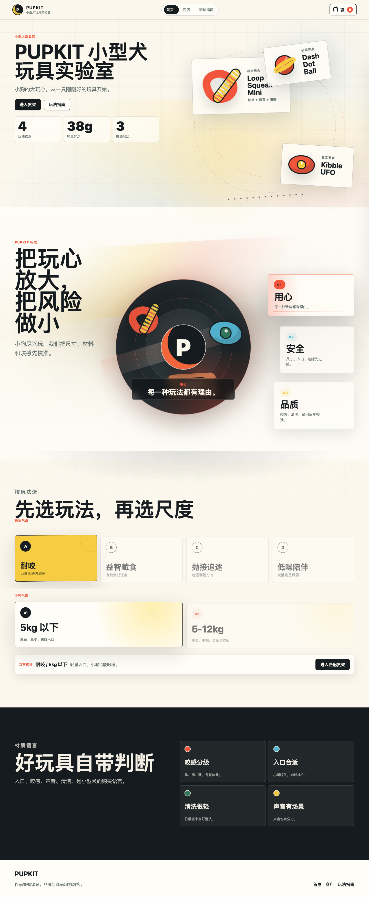
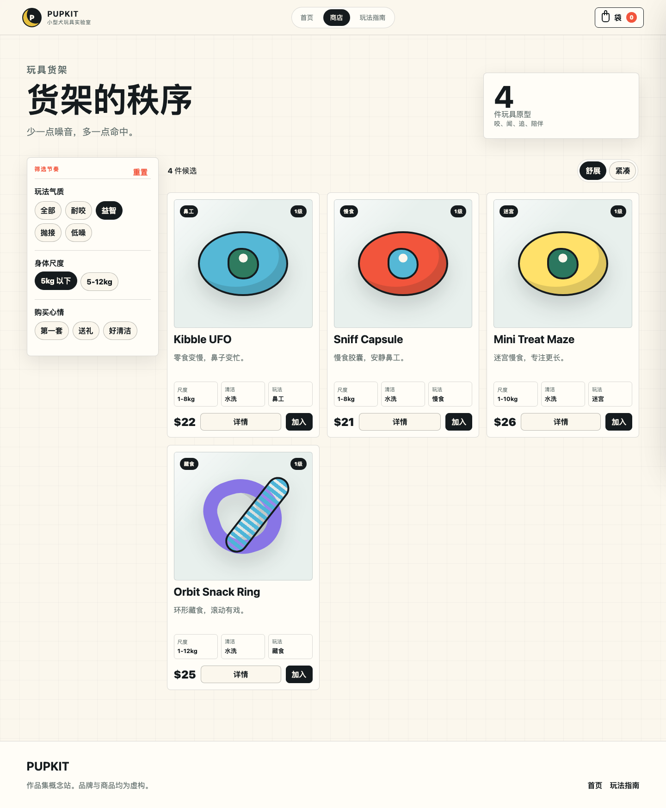
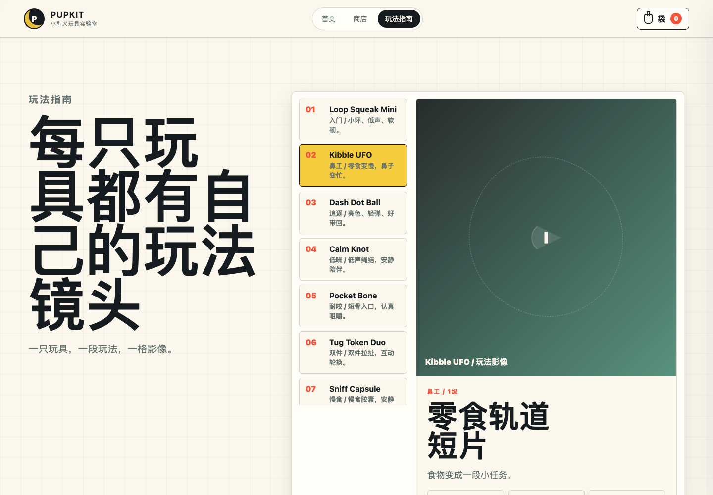
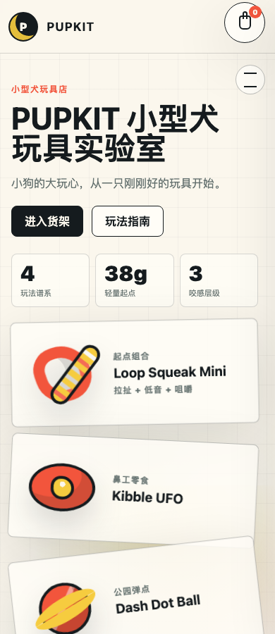

# PUPKIT 小型犬玩具实验室

PUPKIT 是一个作品集用途的电商独立站概念项目，主题是“小型犬玩具”。项目不依赖真实商品图片，而是用 CSS 图形、统一视觉系统和细节动效完成品牌表达、商品浏览、筛选、详情和玩具袋体验。

核心口号：

> 把玩心放大，把风险做小。

## 项目定位

这个站点面向作品集展示，重点不是模拟完整交易系统，而是呈现一个细分类目电商品牌如何通过页面节奏、视觉判断和交互细节建立可信度。PUPKIT 的设定是一家专注小型犬玩具的实验室型品牌，围绕“用心、安全、品质”三个关键词组织商品、文案和界面反馈。

- 品牌：PUPKIT 小型犬玩具实验室
- 品类：小型犬玩具、小型犬互动玩具、慢食益智玩具、低噪陪伴玩具
- 关键词：用心、安全、品质、轻量、可清洗、咬感分级
- 展示目的：电商独立站视觉设计、交互设计、静态前端实现
- 商品状态：品牌与商品均为虚构概念，不用于真实销售

## 页面预览

README 只保留完整页面预览：桌面端展示首页、商店页和玩法指南页，移动端展示一张短截图。局部动效和局部模块不再单独放图，相关设计改用文字说明。

### 首页

首页负责建立品牌第一印象，并把用户从品牌理念自然带进一次明确选择。



### 商店页

商店页是主要商品浏览界面，强调筛选效率、商品判断和详情打开的连续体验。



### 玩法指南

玩法指南用目录和视频框架展示每件商品的玩法节奏，让商品不只是被购买，也有清晰的玩耍场景。



### 移动端

移动端保留品牌识别、导航、商品浏览和玩具袋入口，页面结构改为纵向浏览。



## 页面功能

### 首页 `index.html`

首页的目标是让用户先感受到品牌，再用最短路径进入商品。Hero 区使用品牌图标、短句口号和 CSS 玩具舞台建立第一视觉，右侧图形会跟随鼠标产生轻微位移，让首屏不只是静态海报。

产品理念模块表达 PUPKIT 的三件事：用心、安全、品质。模块保持短句文案，不解释、不教学，用更像品牌判断的语言传达“把玩心放大，把风险做小”。理念卡片支持 hover、focus 和 click，高亮状态会同步影响中央核心图形的颜色和短句。

“按玩法逛”模块不再堆商品，而是让用户先选玩法气质，再选小狗身体尺度。两项都选好后，入口会带着 `play` 和 `weight` 参数进入商店页，商店货架自动收窄到对应商品。

### 商店页 `shop.html`

商店页包含 16 件虚构商品，每件商品都有玩法、尺寸、咬感、清洗方式、适合场景等结构化属性。页面提供三组筛选：玩法气质、身体尺度、购买心情。用户可以从首页带入玩法和尺度筛选，也可以在商店里重新组合筛选，并在舒展 / 紧凑两种货架密度之间切换。

商品卡的交互重点是“被选中感”。鼠标移动到商品卡上时，卡片会抬升、边框增强，商店页还会出现更大、更柔的淡黄色光晕，强化浏览中的聚焦感。这个 hover 光效只作用于商店页，不影响首页商品区。

点击商品卡除“加入”按钮以外的区域，会从右侧打开大产品详情抽屉。详情抽屉保留当前购物流，不跳转到新页面，展示商品卖点、适合玩法、规格标签和加入玩具袋操作。

加入玩具袋时，商品图形会先放大到页面中央，配合柔和暗场和近景模糊，让用户短暂看清商品，再有仪式感地飞入右上角玩具袋。玩具袋支持查看商品数量、小计、减少一件、移除整行。底部“前去支付”是作品集占位按钮，点击会提示“支付功能未接入”。

### 玩法指南 `playbook.html`

玩法指南不是说明书式页面，而是商品玩法的展示框架。左侧目录列出商品，用户切换目录后，右侧视频占位、商品标题、标签和玩法步骤会同步更新。

这个页面的设计重点是把“商品怎么被玩”变成可视化内容。视频区目前只做框架占位，适合后续替换成真实视频、动图或作品集展示素材。

## 设计说明

PUPKIT 的视觉方向是“温暖实验室”。整体不走传统宠物用品站常见的柔软可爱路线，而是把小型犬玩具做成更有标准感和产品判断的独立站。

- 色彩：奶油纸底作为主背景，黑色线条建立品牌识别，柠檬黄作为重点色，红、蓝、绿用于商品信号和模块节奏。
- 图形：所有商品都用 CSS 玩具轮廓表达，不依赖真实摄影，让作品集更像完整视觉系统，而不是素材拼贴。
- 版式：页面使用清晰的模块节奏和低圆角卡片，避免过度装饰；重点区域用大字号、短句和留白建立判断感。
- 动效：动效服务于“高级”和“可感知”，包括鼠标视差、理念卡同步高亮、筛选淡入淡出、详情抽屉、购物袋飞行动画和 hover 聚焦光效。
- 文案：所有文案都遵守“不教用户”的原则，用短句表达模块理念和品牌判断，不写说明书式提示。

## 交互清单

- 首页 Hero 图形随鼠标轻微移动。
- 产品理念卡片 hover / focus / click 时同步更新中心核心状态。
- 首页“按玩法逛”根据玩法和身体尺度生成商店筛选入口。
- 商店页组合筛选会联动商品货架。
- 首页、商店和玩法指南之间使用黑色滑块与渐变遮罩做视觉过渡。
- 商店页商品卡支持淡黄色大范围 hover 光效。
- 商品卡点击后打开右侧详情抽屉。
- 加入玩具袋时触发商品图形聚焦展示和飞入动画。
- 玩具袋支持数量展示、减少一件、移除整行、小计更新和空状态恢复。
- “前去支付”保留为占位反馈，不接入真实支付。
- 玩法指南目录可切换商品玩法内容。
- 移动端无横向滚动，导航、商品卡和玩具袋保持可用。

## 技术实现

项目是纯静态站，方便直接预览和部署。

```text
.
├── index.html
├── shop.html
├── playbook.html
├── assets
│   ├── app.js
│   ├── favicon.svg
│   └── styles.css
├── docs
│   └── screenshots
└── README.md
```

- HTML：三页静态结构，对应首页、商店页和玩法指南页。
- CSS：视觉系统、响应式布局、CSS 商品图形、卡片状态、抽屉、动效和移动端适配。
- JavaScript：商品数据、筛选逻辑、详情抽屉、玩具袋、玩法指南切换、鼠标互动和 toast 反馈。
- 部署方式：无需构建工具，可直接作为静态站部署到 GitHub Pages 或其他静态托管平台。

## 本地预览

直接打开 `index.html` 可以查看页面。为了让路径行为更接近真实部署，也可以启动本地静态服务器：

```bash
python3 -m http.server 8767 --bind 127.0.0.1
```

然后访问：

```text
http://127.0.0.1:8767/index.html
```

## 验证记录

项目收尾阶段做过以下检查：

- `node --check assets/app.js`
- 检查首页、商店页、玩法指南页的桌面和移动端布局。
- 验证首页筛选、商店筛选、右侧详情抽屉、玩具袋动画、商品移除、支付占位提示和玩法指南切换。
- 检查 390px 移动端无横向溢出。
- 删除旧页面停留动画、旧问卷、旧详情页、旧评价、旧手风琴和旧玩法构建器相关残留代码。

## GitHub 仓库信息

- Repository: `dontttbefly-sketch/pupkit-dog-toy-store`
- Description: `PUPKIT 小型犬玩具实验室，一个作品集用途的互动电商独立站。`
- Topics: `portfolio`, `ecommerce`, `static-site`, `interaction-design`, `css-animation`
- Homepage: 可部署到 GitHub Pages 后填写。

## 参考方向

这些品牌只作为品类和市场语境参考，PUPKIT 的品牌、商品和页面内容均为原创虚构概念。

- KONG Rubber Toys
- BARK Super Chewer
- West Paw Zogoflex
- Wild One
- Chuckit!
- Outward Hound / Nina Ottosson puzzle toys

## 声明

PUPKIT、页面文案和商品均为作品集概念内容，不代表真实品牌或真实销售页面。
