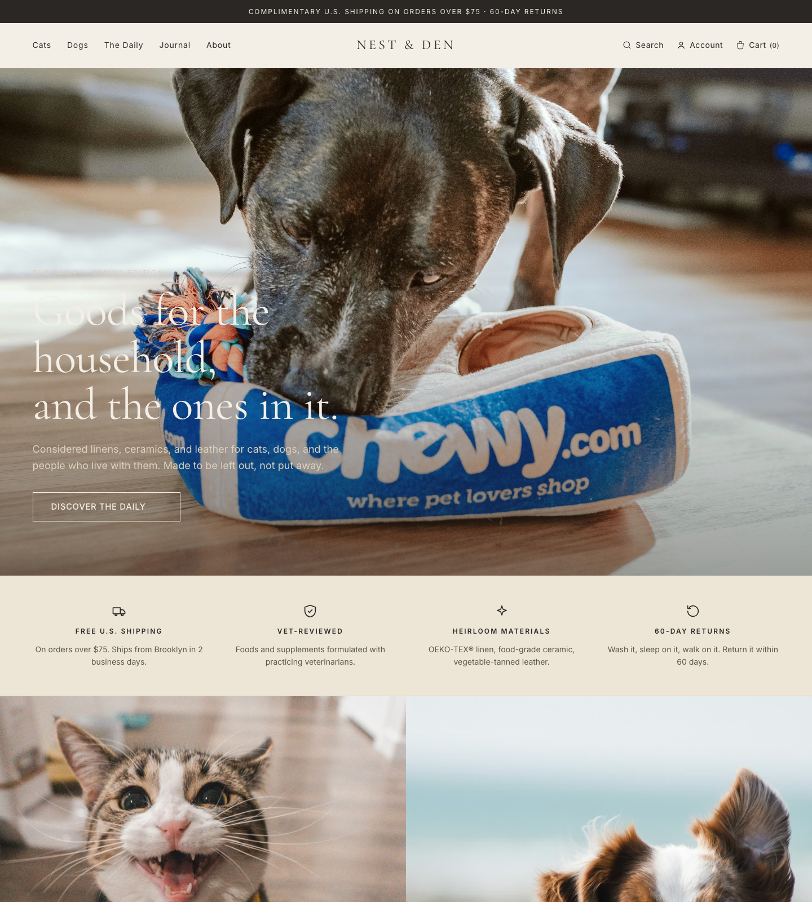
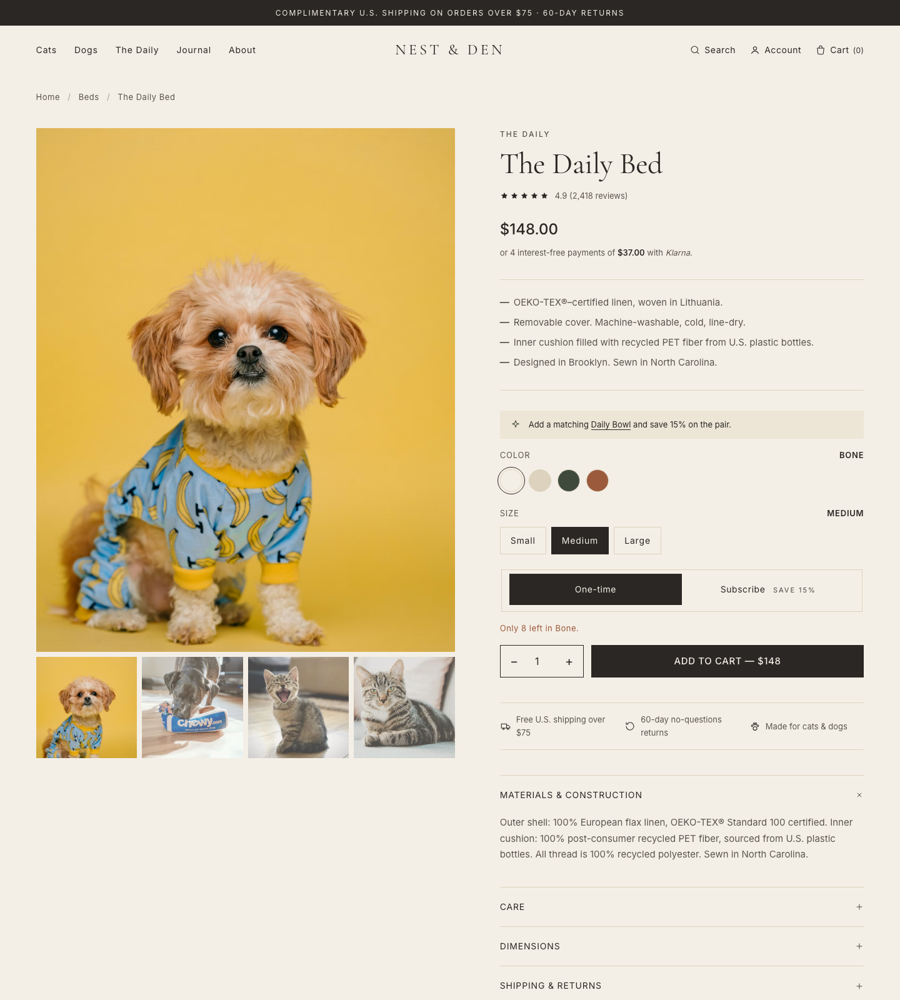

# NEST & DEN 宠物用品电商独立站

Quiet luxury 风格的宠物用品独立站项目，包含一套可部署到 Shopify 的 Liquid 主题，以及一份无需构建步骤的静态 HTML 预览。品牌面向北美 US/CA 市场，覆盖猫狗日常用品、窝垫、餐具、牵引、玩具、服饰与订阅型食品，核心表达是克制、舒适、耐用、适合放进真实家居空间。

> GitHub 仓库描述建议：Quiet luxury Shopify theme and static preview for a North American pet supplies ecommerce brand.

## 项目截图

### 首页



### 产品详情页



## 项目亮点

- 一套完整 Shopify Online Store 2.0 主题，覆盖首页、集合页、产品页、购物车、About、通用页面与 404。
- 一份静态预览站点，纯 HTML/CSS/JS，可直接本地打开或用静态服务预览。
- Quiet Luxury 视觉系统：Bone、Cream、Linen、Ink、Moss、Russet、Bark 等品牌色，搭配 Cormorant Garamond 与 Inter。
- 页面围绕北美电商转化设计：免邮门槛、60 天退货、兽医审核、订阅省 15%、Klarna 分期、评论与支付信任元素。
- 无 React、Vue 或前端构建链，主题代码轻量，方便 Shopify customizer 维护。
- `preview/` 与 `nest-and-den/` 共用视觉语言，适合先在静态页面验证样式，再同步到 Shopify 主题。

## 目录结构

```text
.
├── nest-and-den/                 # Shopify Liquid 主题源码
│   ├── assets/                   # theme.css、theme.js、fonts.css
│   ├── config/                   # Shopify settings schema 与默认配置
│   ├── layout/                   # theme.liquid 页面骨架
│   ├── locales/                  # 英文 UI 文案
│   ├── sections/                 # 可在 Shopify 后台编辑的 sections
│   ├── snippets/                 # 产品卡、价格、图标、支付方式等组件
│   └── templates/                # 首页、集合页、PDP、购物车、页面、404
├── preview/                      # 静态 HTML/CSS/JS 预览
│   ├── assets/                   # 与主题保持一致的样式和交互
│   ├── index.html                # 首页
│   ├── product.html              # 产品详情页
│   ├── collection.html           # 集合页
│   ├── about.html                # 品牌页
│   ├── cart.html                 # 购物车演示页
│   └── 404.html                  # 404 页面
└── docs/screenshots/             # README 使用的项目截图
```

## 快速预览

最简单的方式是直接打开静态预览：

```bash
cd preview
python3 -m http.server 8000
```

然后访问：

```text
http://localhost:8000
```

也可以直接双击 `preview/index.html`，不过推荐使用本地静态服务，避免部分浏览器对 `file://` 下字体或资源加载的限制。

## Shopify 主题运行

需要先安装 Shopify CLI，并准备一个 Shopify Partner Dev Store。

```bash
cd nest-and-den
shopify theme dev --store=your-dev-store.myshopify.com
```

后续已登录时可直接运行：

```bash
shopify theme dev
```

Shopify CLI 会启动本地预览地址，并将主题改动同步到开发店铺。即使开发店铺暂时没有真实商品，主题内也准备了 demo 文案与占位图回退，方便快速查看页面结构。

## 生产部署

将主题推送为未发布主题：

```bash
cd nest-and-den
shopify theme push --store=your-store.myshopify.com --unpublished
```

进入 Shopify 后台后，建议按顺序配置：

1. Online Store -> Navigation：创建 `main-menu`，包含 Cats、Dogs、The Daily、Journal、About。
2. Products -> Collections：创建 `cats`、`dogs`、`the-daily` 等集合。
3. Settings -> Markets：配置 US/CA 市场与 USD。
4. Settings -> Payments：启用 Shop Pay、Apple Pay、Google Pay、PayPal、Klarna。
5. Settings -> Shipping：配置 Free U.S. shipping over $75。
6. Apps：可选安装 Shopify Subscriptions、Judge.me 或 Loox，承接订阅与真实评论。

## 主要页面

| 页面 | 静态预览 | Shopify 模板 | 说明 |
| --- | --- | --- | --- |
| 首页 | `preview/index.html` | `nest-and-den/templates/index.json` | Hero、信任条、分类入口、精选商品、材质叙事、媒体背书、UGC、Newsletter |
| 产品页 | `preview/product.html` | `nest-and-den/templates/product.json` | 图库、价格、变体、订阅切换、加购、sticky ATC、评价、推荐 |
| 集合页 | `preview/collection.html` | `nest-and-den/templates/collection.json` | Banner、筛选侧栏、产品网格、editorial 插卡、分页 |
| About | `preview/about.html` | `nest-and-den/templates/page.about.json` | 品牌故事、价值观、材料工艺 |
| 购物车 | `preview/cart.html` | `nest-and-den/templates/cart.json` | 演示态购物车、摘要、信任信息 |
| 404 | `preview/404.html` | `nest-and-den/templates/404.json` | 品牌化空状态 |

## 设计系统

| Token | Hex | 用途 |
| --- | --- | --- |
| Bone | `#F4EFE6` | 主背景 |
| Cream | `#EDE5D6` | 次级背景 |
| Linen | `#DCD2BD` | 分割线、浅边框 |
| Ink | `#2A2724` | 正文、按钮、核心 UI |
| Ink Soft | `#5A554F` | 副文案 |
| Moss | `#3F4A3C` | 猫品类与自然感强调 |
| Russet | `#9C5A3C` | 狗品类与暖色强调 |
| Bark | `#6B4A38` | Hover 与深暖色强调 |

字体：

- Display：Cormorant Garamond
- Body：Inter

上线前可将 Google Fonts CDN 替换为自托管 `woff2`，减少首屏字体阻塞并提升可控性。

## 交互能力

- 移动端菜单开合
- 滚动 reveal 动效
- PDP 手风琴信息区
- PDP 颜色与尺寸变体演示
- 数量步进器
- 加购按钮演示反馈
- 移动端 sticky add-to-cart
- 集合页筛选链接参数演示

## 质量检查

Shopify 主题建议执行：

```bash
cd nest-and-den
shopify theme check
```

静态预览建议手动检查：

- 首页、集合页、产品页、购物车、About、404 均可打开。
- 桌面、平板、手机视口下排版无明显溢出。
- PDP 变体、数量、手风琴、sticky ATC 可交互。
- 集合页筛选链接可正常跳转。
- 关键 CTA、价格、退换货、免邮、支付信任信息清晰可见。

## 图片与授权

当前 demo 图片来自 Unsplash CDN，仅用于占位和视觉预览。正式上线前建议替换为品牌自有摄影，并补充图片版权与授权记录。

## 维护建议

- 样式优先在 `preview/assets/theme.css` 中快速验证，再同步到 `nest-and-den/assets/theme.css`。
- Shopify sections 的内容配置集中在 `templates/*.json` 和 section schema 中维护。
- 产品、集合、支付、物流、订阅与评论数据应交给 Shopify 后台或对应 App 管理。
- 若要扩展多语言或多市场，可从 `locales/`、Markets 与 Shopify Translate & Adapt 开始。

